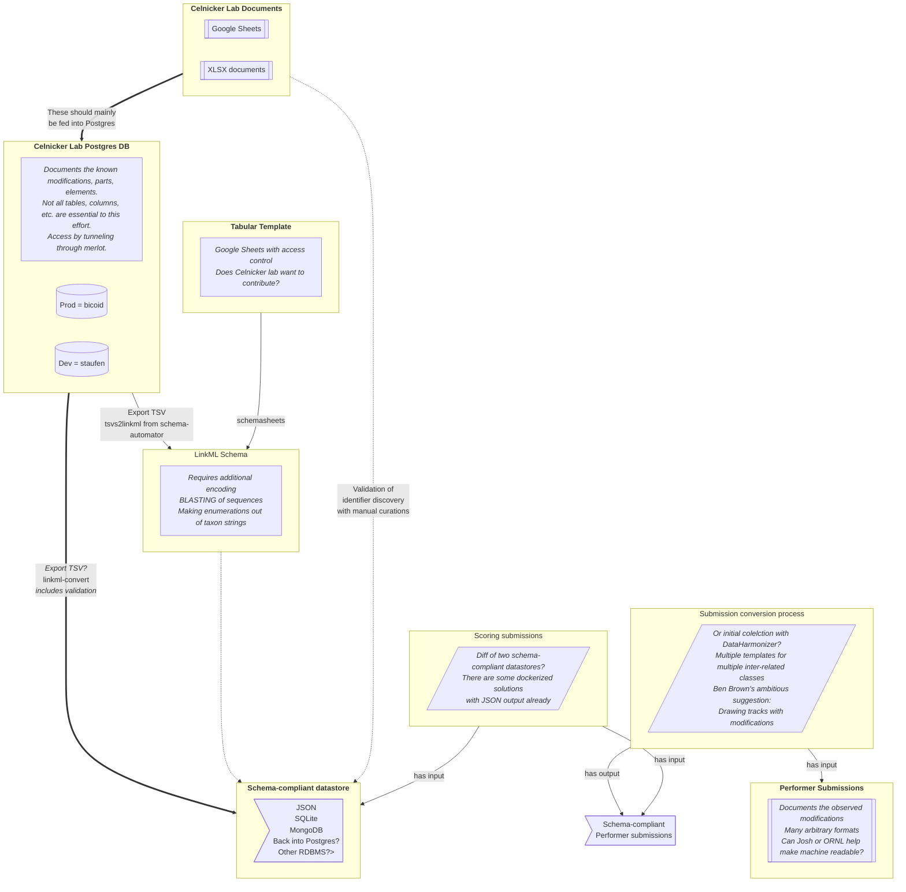

# synbio-bestof

This repo pulls together useful parts from various synthetic biology modeling repositories, especially with respect to the IARPA FELIX project. Will problaby be renamed soon.

Usage notes coming soon

## Various FELIX data sources, schema generation, and data validation/conversion 

